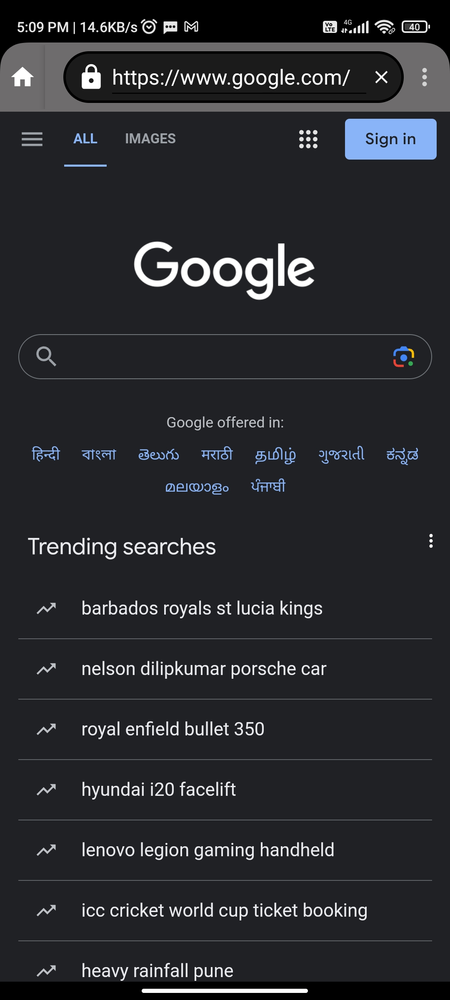
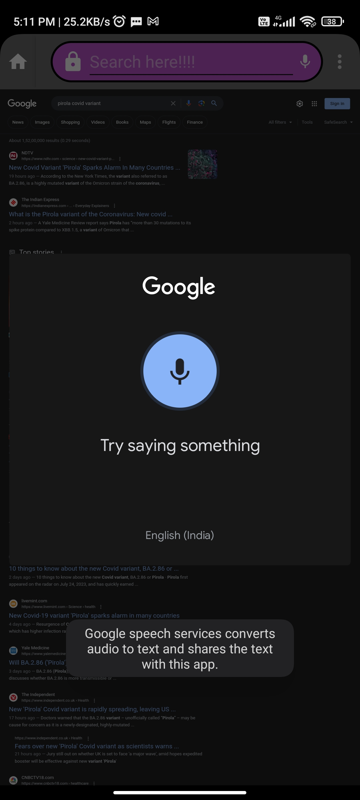
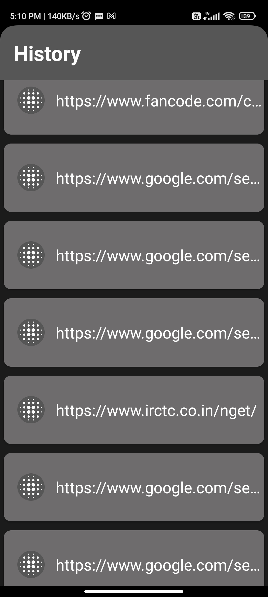
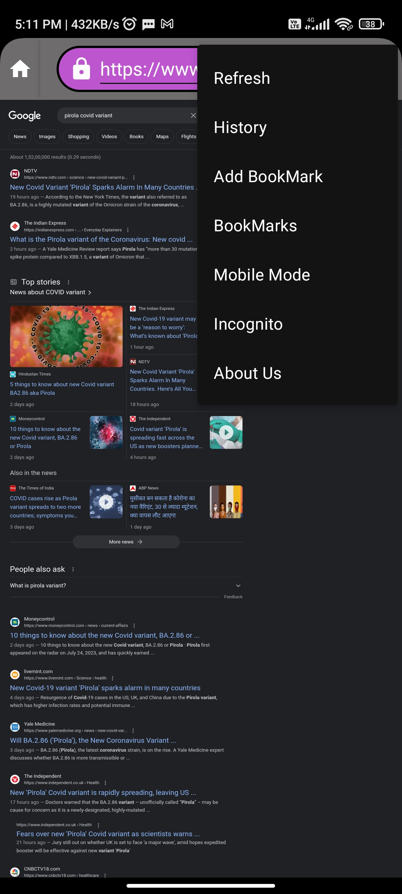
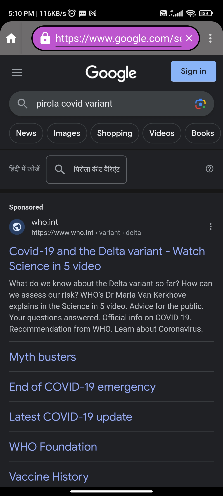

# Origin Browser App

Origin is a user-friendly Android browser app built using WebView technology. It offers a seamless web browsing experience with several features to enhance privacy and convenience.

## Features

### 1. Voice Search
- Origin includes a search bar with Google Mic integration for voice search, making it easy to search the web using your voice.

### 2. Local History Storage
- Your browsing history is stored locally on your device for improved privacy. Origin does not sync your browsing history to the cloud.

### 3. Bookmarking
- You can easily bookmark your favorite websites for quick access, making it convenient to revisit your preferred online destinations.

### 4. Desktop Mode
- Origin provides a desktop mode, allowing you to view websites in their desktop layout for a more comprehensive browsing experience.

### 5. Incognito Mode
- For private browsing, Origin offers an incognito mode that doesn't save your browsing history, cookies, or site data.

## Contact

If you have any questions, feedback, or need assistance, please reach out to us at hashmack17@gmail.com.

Happy browsing with Origin!
